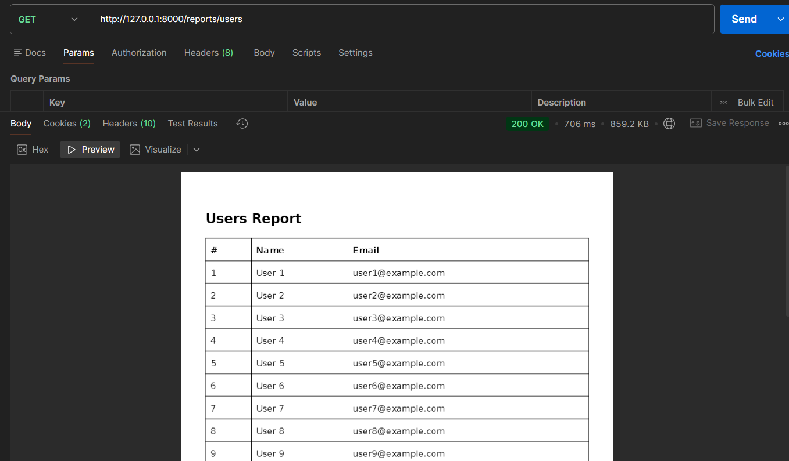
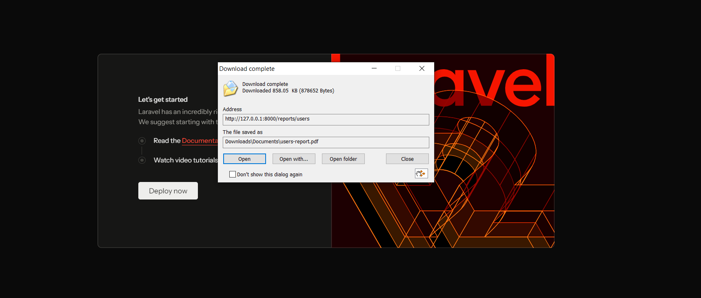
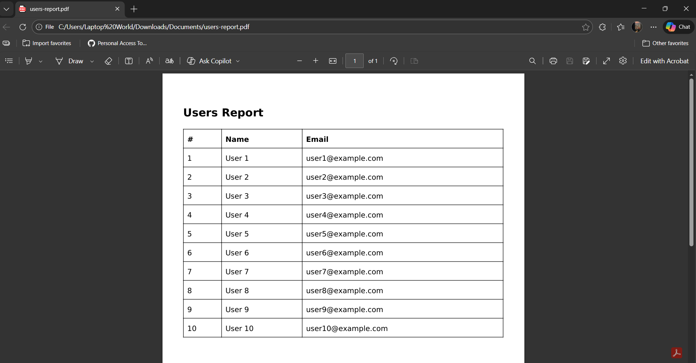

# Laravel Users PDF Report API

This is a Laravel project that demonstrates how to generate a PDF report of users in the backend. It includes a Seeder to populate sample users and an endpoint to download or view the PDF.

---

### Features

- Generate PDF reports using **Dompdf**.
- API endpoint to download or stream PDF.

---
### Install DomPDF

```php
composer require barryvdh/laravel-dompdf
```

-----

### You can preview the PDF in Postman or download it from the web.
#### In Postman
- 
#### OR
#### Download from the web
- 
- 


